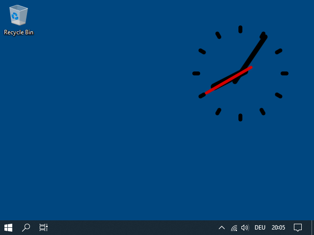

# desktop-widgets

use frameless browser windows as desktop widgets that do not minimize on "Show Desktop" (Windows+D)

## General

The widgets are small HTML pages that are brought to the desktop with
[Node.js](https://nodejs.org/),
[Electron](https://www.electronjs.org/) and
[electron-disable-minimize](https://github.com/tbvjaos510/electron-disable-minimize).

Installation of the tools should be pretty straight-forward. Just a quick outline is presented here:

	# Install Node.js first
	mkdir desktop-widgets
	cd desktop-widgets
	npm init
	npm install --save-dev electron
	
	# add to package.json:
	{
	  "scripts": {
	    "start": "electron ."
	  }
	}
	
	npm i -S electron-disable-minimize
	.\node_modules\.bin\electron-rebuild
	
	npm install --save-dev @electron-forge/cli
	npx electron-forge import
	npm run make

## electron-disable-minimize

Not minimizing on "Show Desktop" is the key part of the whole project and it did not work out of the box for me.
It did not work on Windows 10, neither on Windows 11. I did quite some research and found
[this resource](https://stackoverflow.com/questions/1669111/how-do-i-get-the-window-handle-of-the-desktop#5691808):

	HWND hShellWnd = GetShellWindow();
	HWND hDefView = FindWindowEx(hShellWnd, NULL, "SHELLDLL_DefView", NULL);
	HWND folderView = FindWindowEx(hDefView, NULL, "SysListView32", NULL);

I patched electron-disable-minimize with this code snippet. That only worked temporarily because it seems to be
unstable. `GetShellWindow()` returns `"Progman"`. There is no guarantee that `"SHELLDLL_DefView"`and
`"SysListView32"` are children. One has to be "lucky", sort of.

Therefore I did more research and finally found
[another resource](https://www.codeproject.com/articles/856020/draw-behind-desktop-icons-in-windows-plus).
That one explains the "problem" with the Windows desktop in great detail and also provides a solution.
So I finally patched `lib.cc` from electron-disable-minimize:

	#include <nan.h>
	#include <v8.h>
	
	using namespace std;
	using namespace Nan;
	using namespace v8;
	
	using v8::FunctionCallbackInfo;
	using v8::Isolate;
	using v8::Local;
	using v8::Object;
	using v8::String;
	using v8::Value;
	
	NAN_METHOD(DisableMinimize)
	{
	    if (info.Length() >= 2)
	    {
	        return Nan::ThrowError("electron-disable-minimize: Invalid number of arguments. Should be 1");
	    }
	
	    v8::Local<v8::Object> bufferObj;
	
	    if (info[0]->IsArrayBufferView() && info[0]->IsObject() && info[0]->IsTypedArray() && info[0]->IsUint8Array())
	    {
	        bufferObj = info[0].As<v8::Object>();
	    }
	    else
	    {
	        Nan::ThrowTypeError("\n\nArgument must be a HWND handle!\nPlease use \"yourBrowserWindow.getNativeWindowHandle();\"\nhttps://electronjs.org/docs/api/browser-window#wingetnativewindowhandle\n");
	        info.GetReturnValue().Set(Nan::False());
	        return;
	    }
	    unsigned char *bufferData = (unsigned char *)node::Buffer::Data(bufferObj);
	    unsigned long handle = *reinterpret_cast<unsigned long *>(bufferData);
	    HWND hwnd = (HWND)handle;
	    HWND parent = NULL;
	
	    HWND hProgman = FindWindowEx(NULL, NULL, "Progman", NULL);
	    SendMessage(hProgman, 0x052C, NULL, 0);
	
	    HWND desktop = GetDesktopWindow();
	    HWND hWorkerW = NULL;
	    HWND hShellViewWin = NULL;
	    do
	    {
	        hWorkerW = FindWindowEx(desktop, hWorkerW, "WorkerW", NULL);
	        hShellViewWin = FindWindowEx(hWorkerW, 0, "SHELLDLL_DefView", 0);
	    } while (hShellViewWin == NULL && hWorkerW != NULL);
	    if (hWorkerW != NULL)
	    {
	        hWorkerW = FindWindowEx(desktop, hWorkerW, "WorkerW", NULL);
	        if (hWorkerW != NULL)
	        {
	            parent = hWorkerW;
	        }
	    }
	
	    if (parent == NULL)
	    {
	        info.GetReturnValue().Set(Nan::False());
	    }
	    else
	    {
	        SetParent(hwnd, parent);
	        info.GetReturnValue().Set(Nan::True());
	    }
	}
	
	NAN_MODULE_INIT(Initialize)
	{
	    NAN_EXPORT(target, DisableMinimize);
	}
	
	NODE_MODULE(addon, Initialize);

There is one known issue left: Killing the process leaves black rectangles on the Desktop that only disappear
after a reboot of the system.

## Widget: clock

The JavaScript code for the clock is based on the example from the
[MDN tutorial](https://developer.mozilla.org/en-US/docs/Web/API/Canvas_API/Tutorial/Basic_animations).

## Widget: clock10hrs

The JavaScript code for the 10-hour clock is also based on the example from Mozilla.
This is a 10-hour clock where one day has 10 hours, one hour 100 minutes and one minute 100 seconds. Thus a specific
time can be written as a decimal and it is possible to simply add two time spans, e.g. "8.2379".

